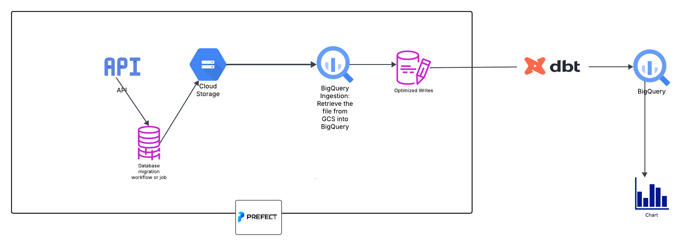
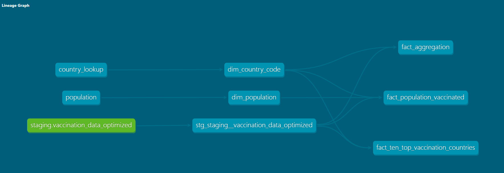
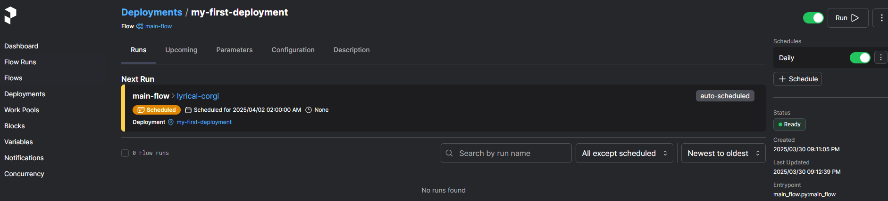
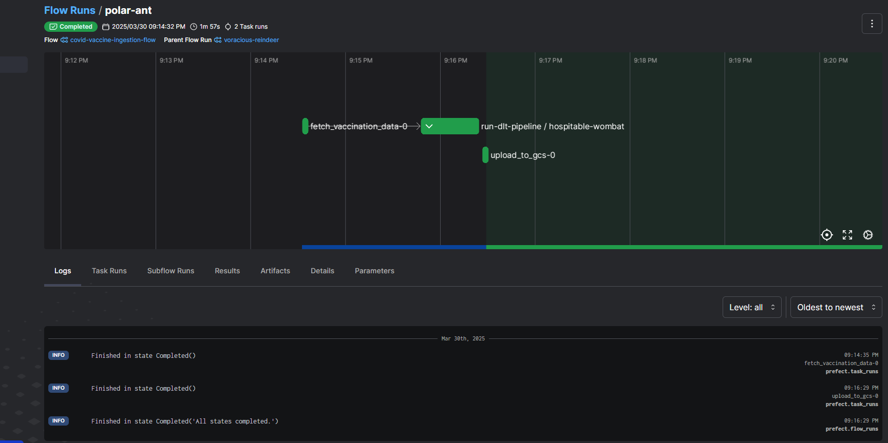
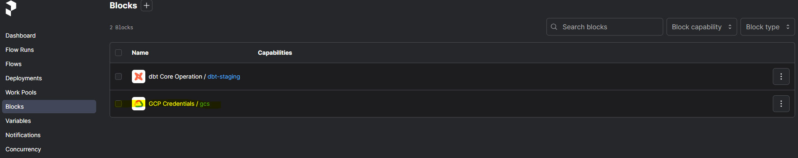
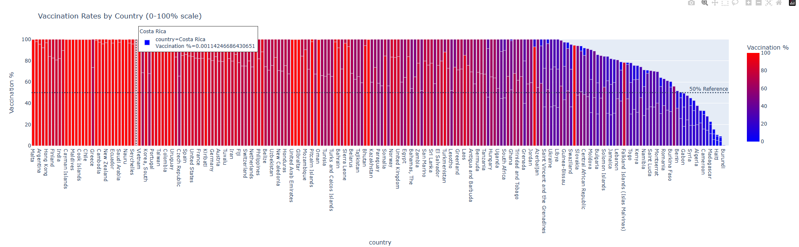
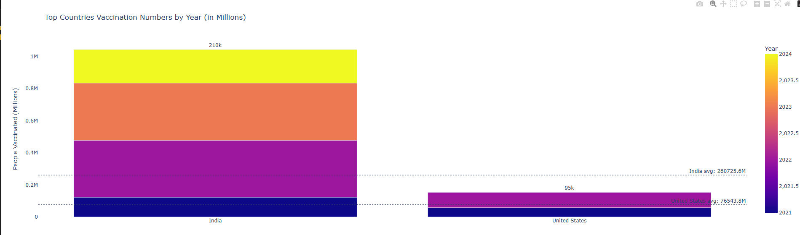
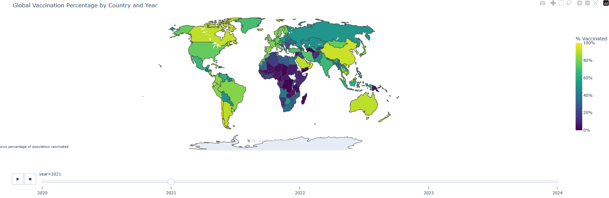

# 🏥 COVID-19 Vaccination Data Pipeline & Analytics Dashboard

[](https://python.org)
[](https://plotly.com)

## 🌐 Problem Description

**Core Problem:** Public health organizations need real-time visibility into global COVID-19 vaccination progress to:

- Identify coverage gaps
- Allocate resources effectively
- Monitor campaign effectiveness
- Compare country performance

**Specific Challenges:**

- Data comes from multiple inconsistent sources
- Raw data requires complex cleaning/transformation
- Analysis needs to handle billions of records efficiently
- Stakeholders need intuitive visualizations
- Solutions must work across different IT environments

---

## 🛠 Tools and Technologies Used

- **dlt**: A data pipeline framework for efficient data ingestion into data warehouses.
- **dbt**: A tool for transforming raw data in the data warehouse using SQL.
- **Prefect**: A workflow orchestration tool to automate and schedule the pipeline to ensure data freshness.
- **DuckDB** / **BigQuery**: Data warehouse for storing the ingested and transformed data.
- **Google Cloud Storage**: For storing Parquet files.
- **Plotly:** For Interactive visualizations.

---

## 📋Folder Structure

```
/project-directory

│   ├── requirements.txt
│
├── /dasboards/
│   ├── Dockerfile
│   ├── ingest.py
│   ├── load_bigquery.py
│   ├── requirements.txt
│
├── /dbt
│   ├── models/
│   │   ├── core/
│   │   └──── dim_country_code.sql
│   │   └──── dim_population.sql
│   │   └──── fact_aggregation.sql
│   │   └──── fact_population_vaccinated.sql
│   │   └──── fact_ten_top_vaccination_countries.sql
│   │   └──── schema.yml
│   │   └── staging/
│   │   └──── schema.yml
│   │   └──── stg_staging__vaccination_data_optimized.sql
│   ├── macros/
│   │   ├── create_packages.sql
│   │   ├── daily_difference.sql
│   │   ├── fill_nulls.sql
│   ├── seeds/
│   │   ├── country_lookup.csv
│   │   ├── population.csv
│   ├── dbt_project.yml
│   ├── profiles.yml


├── flow
│   ├── dbt_flow.py
│
├── /tasks    # prefect tasks
│   ├── ingestion_flow.py
│   ├── biquery_ops.py
│   ├── create_partitioned_table.py
├── /utils  # bucket config tasks
│   ├── config.py

├── /config  # contain gcs json
│   ├── service_account.json

├── /tests/  # testing components
├── /ci_cd/  # ci/cd components


│
└── README.md
```

---

**The pipeline** is downloading from an api, storing the file into a bucket at gcs as a parquet file, retrieving it from gsc to bigquery then partitioning and clustering it before dbt's work.



### ✨Getting Started

## Prerequisites

1. Google Cloud account with BigQuery access
2. Python 3.8+
3. Prefect Cloud account (optional)

```bash
# Clone repository
git clone https://github.com/JOHNFFFEE/DE_Datacamp_Project2025
cd DE_Datacamp_Project2025

# Set up environment
python -m venv prefect-env
source prefect-env/bin/activate  # Linux/Mac
prefect-env\Scripts\activate    # Windows

# Install dependencies
pip install -r requirements.txt

#Run prefect
prefect server start

# To run the pipeline from the root
python main_flow.py

```

it is already scheduled you will be able to see it under the deployment section

---

To move the data to your GCS and Bq change the settings under

```python
# config.py
PROJECT_ID = "your-gcp-project"
DATASET_ID = "covid_raw_data"
BUCKET_NAME = "your-vaccination-data-bucket"
```

Set up authentication:

```bash
set GOOGLE_APPLICATION_CREDENTIALS="path/to/credentials.json"
** this is critical because the Json code is stored secretly
```

## Pipeline Overview

### **dlt (Data Loading Tool)**

**dlt** is used to ingest COVID-19 vaccination data from an external API into a data warehouse or cloud storage.

#### How dlt Works:

1. **Pipeline Definition**: The pipeline is defined using `dlt.pipeline()`, where you specify the destination (e.g., DuckDB or BigQuery).
2. **Data Ingestion**: Using `dlt.resource()`, data from the COVID vaccination source is fetched and ingested.
3. **Storage**: Data is stored in Parquet format in cloud storage (e.g., Google Cloud Storage).
4. **Pipeline Execution**: The pipeline is run using `pipeline.run()` to perform the ingestion and normalization process.

- ingestion_flow.py

### **Scripts under tasks using Prefect**

The script will move the the parquet file from GCS (Google Cloud Storage) to BQ (Bigquery).

- bigquery_ops.py

Then before dbt usage, the data will be optimized, the table created will be partitioned by date anc clustered by iso and location.

- create_partitioned_table.py

```sql
CREATE OR REPLACE TABLE `covid_raw_data.vaccination_data_optimized`
PARTITION BY vaccination_date
CLUSTER BY location, iso_code
AS SELECT * FROM temp_vaccination;
```

### **dbt (Data Build Tool)**



**dbt** is used to transform the raw vaccination data into structured, analytics-ready tables. You define SQL-based transformation models and execute them using dbt.

#### How dbt Works:

1. **Model Creation**: Models are SQL files containing data transformation logic.
2. **Data Transformation**: The SQL models transform raw data into clean, structured tables with the help of _macros_
3. **Running dbt**: The `dbt run` command is used to execute the models and perform the transformations.

```bash
cd dbt
dbt run
```

you can check your connection

```bash
cd dbt
dbt debug
```

You can connect your DBT Cloud account to your github and run all the files dont forget to update profiles.yml, dbt-project.yml

---

### **Integration of dlt and dbt**

- **dlt** handles the ingestion of raw vaccination data from external APIs into your storage system.
- **dbt** transforms the raw data into structured, analytics-ready tables.
- **Prefect** automates and orchestrates these tasks, running the entire pipeline on a scheduled basis.

---

## Workflow Orchestration with Prefect

**Prefect** is used to automate and schedule the ingestion and transformation tasks.

1. **Create a Flow**: Define your pipeline logic using `@flow` decorator.
2. **Create a Deployment**: Define when and how the flow should be run (e.g., daily).
3. **Run and Monitor**: Prefect monitors the execution, ensuring the pipeline runs smoothly.

---

## How to Set Up and Run the Pipeline

### Step 1: Set Up the Environment

To set up the environment, ensure all dependencies are installed and the Python environment is properly configured:

```bash
# Install dependencies from requirements.txt
pip install -r requirements.txt

# Set Google Cloud credentials (if using Google Cloud for storage)
set GOOGLE_APPLICATION_CREDENTIALS="/path/to/service_account.json"
```

### Step 2: Run the Pipeline

Run the pipeline either directly with Python or via Prefect for orchestration:


```bash
# Run the pipeline directly with Python
python main_flow.py
```



Alternatively, use **Prefect** to manage scheduling and orchestration via the ui at : http://localhost:4200/deployments

set GCP block call it

to save GCS json file and use it into your code

---

## 📊Interactive Dashboards

We've created three comprehensive dashboards:

Dashboard 1: Country Analysis


```bash
python dashboards\country_analysis.py
```

Dashboard 2: Top countries Vaccination


```bash
python dashboards\top_countries.py

```

Dashboard 3: Vaccination Heatmap


```bash
python dashboards\heatmap.py
```

don't forget to run the server first, the data is taken from bq and plotting it.

---

License
This project is licensed under the MIT License - see the LICENSE file for details.

---
